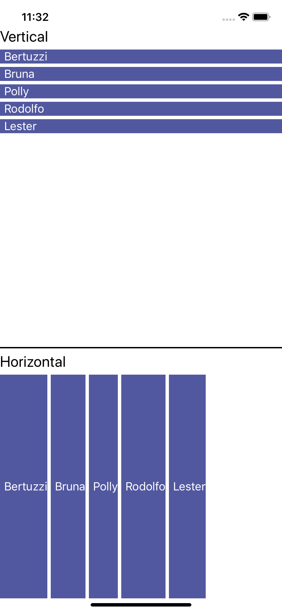

# Xamarin.Forms.DynamicLayout

Dynamic Layout for Xamarin.Forms. 

Use horizontal or vertical controls like a listview.
 
 ###### This is the component, works on iOS, Android and UWP.
 
 <a href="#">
</a>

**NuGet**

|Name|Info|
| ------------------- | :------------------: |
|MultiSelectListView|[](https://www.nuget.org/packages/Xamarin.Forms.DynamicLayout/)|

**Platform Support**

DynamicLayout is a .NET Standard 2.0 library.Its only dependency is the Xamarin.Forms

## Setup / Usage

install the package in the shared project

in the Xaml file we must declare our control xmlns:controls="clr-namespace:Xamarin.Forms.DynamicLayout;assembly=Xamarin.Forms.DynamicLayout", for example .

```csharp
<controls:DynamicLayout
                Source="{Binding Users}"
                HorizontalOptions="FillAndExpand"
                Orientation="Vertical"
                Spacing="2">
                <controls:DynamicLayout.ItemTemplate>
                    <DataTemplate>
                        <Grid BackgroundColor="#52589F">
                            <Grid.ColumnDefinitions>
                                <ColumnDefinition Width="*" />
                            </Grid.ColumnDefinitions>
                            <Label Text="{Binding Name}" TextColor="White" FontSize="Medium" VerticalTextAlignment="Center" />
                        </Grid>
                    </DataTemplate>
                </controls:DynamicLayout.ItemTemplate>
</controls:DynamicLayout>
            
```

Use source for for your objectcollection and customize yout template.

The complete example can be downloaded here: https://github.com/TBertuzzi/Xamarin.Forms.DynamicLayout/tree/master/DynamicLayoutSample


